# Silverpeas - TryHackMe Report
## Target Information
- **Name:** [Silver Platter](https://tryhackme.com/room/silverplatter)
- **Platform** TryHackMe
- **Difficulty:** Easy
- **Creator:** [TeneBrae93](https://tryhackme.com/p/TeneBrae93)

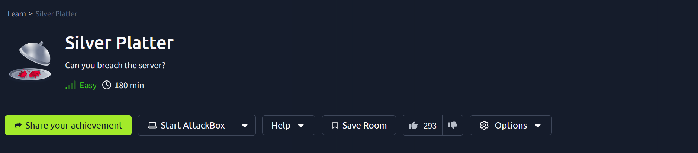

Uncover the flaws lurking beneath the surface of the Silverpeas platform. This box challenges you to exploit a critical authentication bypass vulnerability to gain initial access, pivot through compromised credentials, and escalate privileges. Test your web exploitation and enumeration skills while navigating through this real-world web application.

---

## Enumeration

### Nmap Scan
```bash
nmap -sS -sC -sV -T4 -p- 10.10.120.135 -oN /home/kali/boxes/silver/nmap.txt
```
**Flags Explained:**
- `-sS`: SYN Scan (stealth)  
- `-sC`: Run default scripts  
- `-sV`: Version detection  
- `-T4`: Aggressive timing  
- `-p-`: Scan all 65,535 ports  
- `-oN`: Save output to a file

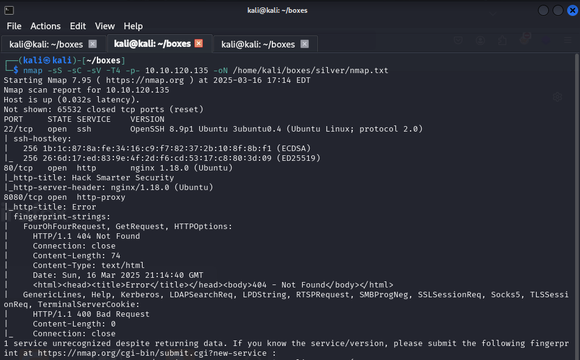

**Results:** Ports **22 (SSH)**, **80 (HTTP)**, and **8080 (HTTP Proxy)** are open.  

---

## Gobuster - Directory Enumeration
#### Port 80
```bash
gobuster dir -u http://10.10.120.135 -w /usr/share/wordlists/dirb/common.txt -t 50 -x php,html,xml -o /home/kali/boxes/silver/gobuster80.txt
```
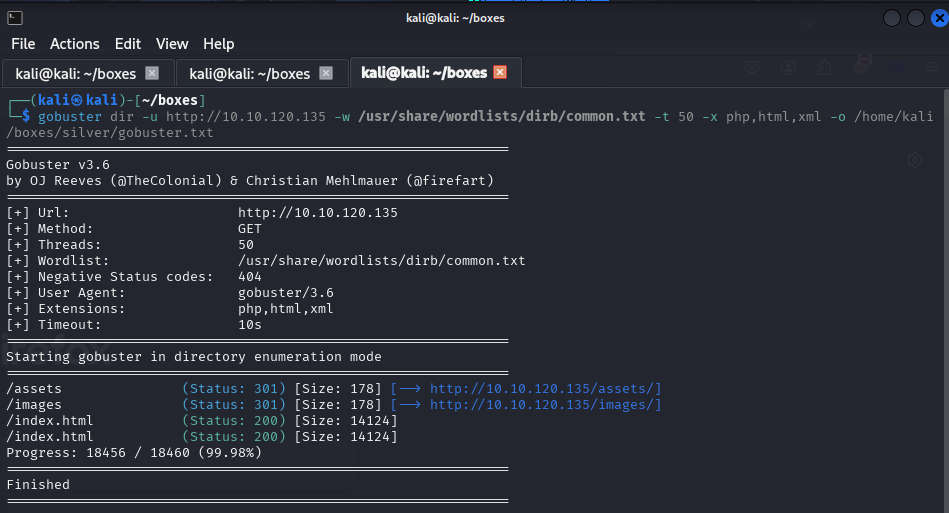

#### Port 8080
```bash
gobuster dir -u http://10.10.120.135:8080 -w /usr/share/wordlists/dirb/common.txt -t 50 -x php,html,xml -o /home/kali/boxes/silver/gobuster8080.txt
```
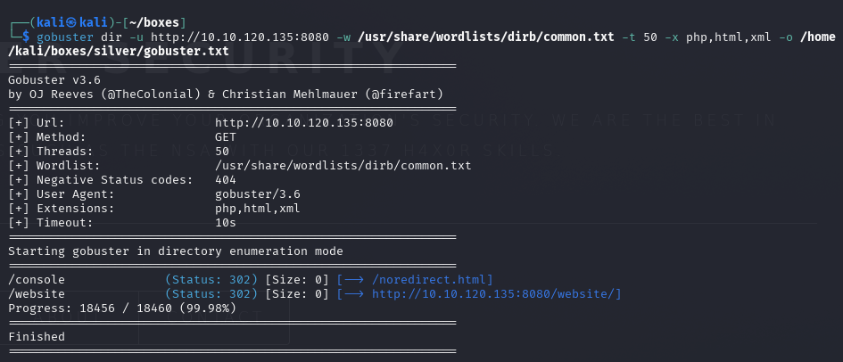
**Flags Explained**
- `-w /usr/share/wordlists/dirb/common.txt` The wordlist to use for brute-forcing.
- `-t 50` Number of threads to use for faster scanning.
- `-x php,html,xml` File extensions to search for (e.g., .php, .html, and .xml).
- `-o /home/kali/boxes/mrrobot/gobuster.txt` Save the output to a text file for reference.

**Findings:**
### Port 80
- No `robots.txt`
- Source code reveals potential usernames:
  - `tyler`
  - `Tyler Ramsbey`
  - `scr1ptkiddy`
- Mentions of `Silverpeas`

**Port 8080:**
- `/console` redirects to an empty page
- `/website` - Forbidden
- No `robots.txt`

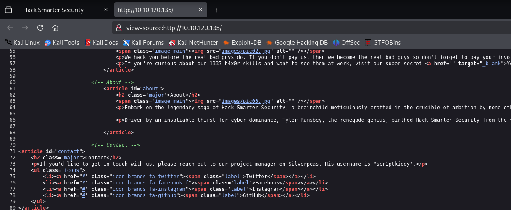

---
## Silverpeas Installation Documentation

Reference: [Silverpeas Installation Guide](https://www.silverpeas.org/installation/installationV6.html)

- Default credentials: `SilverAdmin/SilverAdmin`
- Navigated to:
```bash
http://10.10.120.135:8080/silverpeas/
```

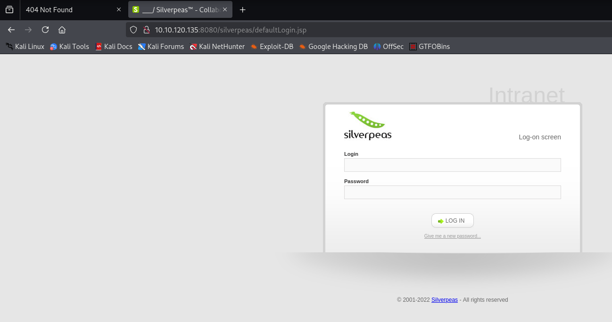

- Login unsuccessful.
- Password reset function reveals that both `SilverAdmin` and `scr1ptkiddy` are valid users.

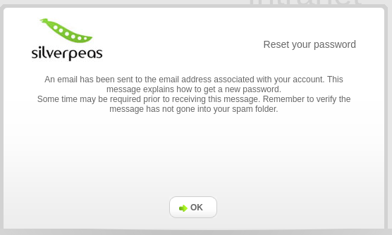

---
## Exploitation

### Silverpeas Authentication Bypass (CVE-2024-36042)

Reference: [Exploit Code](https://gist.github.com/ChrisPritchard/4b6d5c70d9329ef116266a6c238dcb2d)
- Used Burp Suite to intercept the login request.
- Removed the password field from the request.

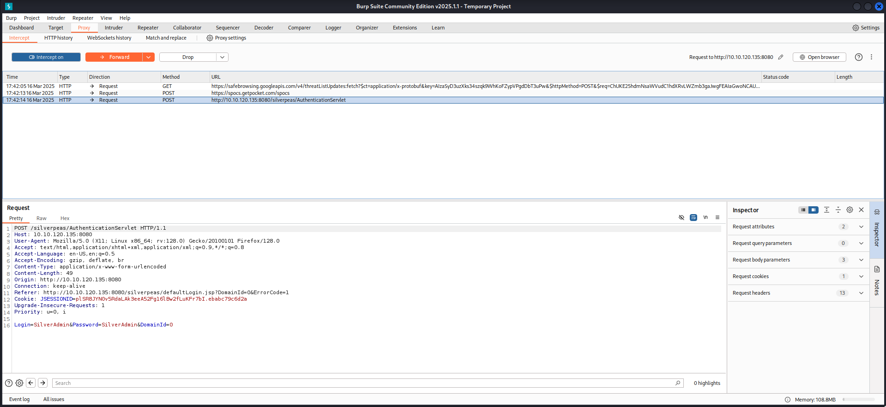
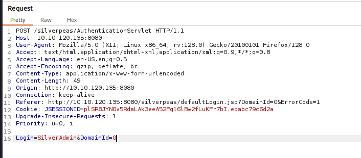

- Successfully logged in as `SilverAdmin`.

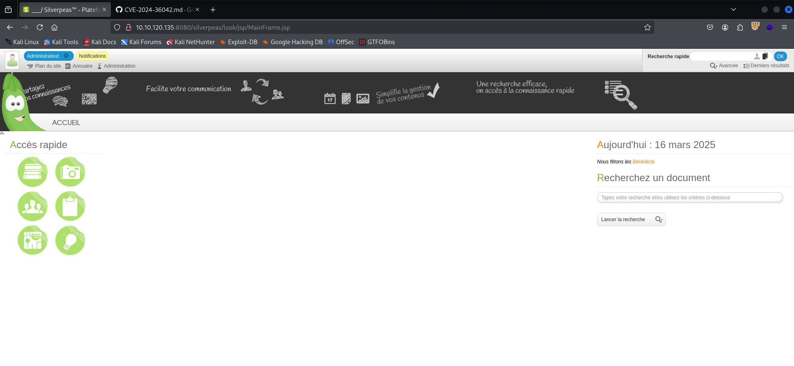

---
### Post-Exploitation

- Discovered three accounts:
    - `manager`
    - `silveradmin`
    - `scr1ptkiddy`

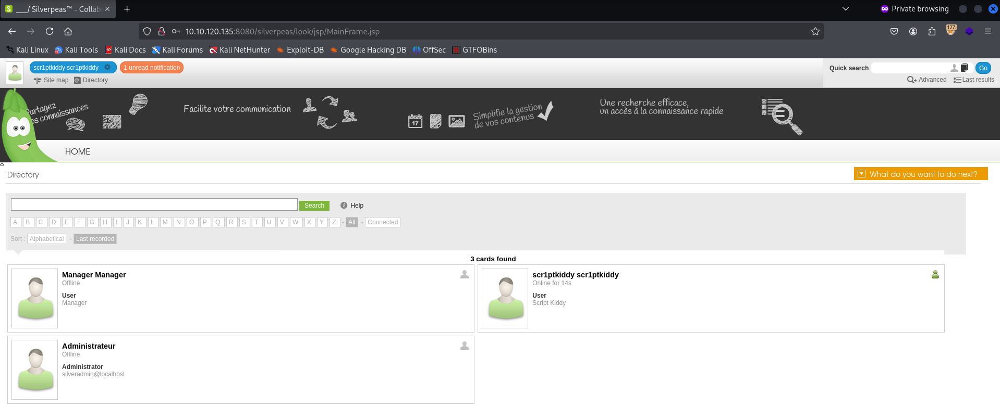

- Found a notification in the `manager` account containing SSH credentials:
```bash
Username: tim
Password: [REDACTED]
```

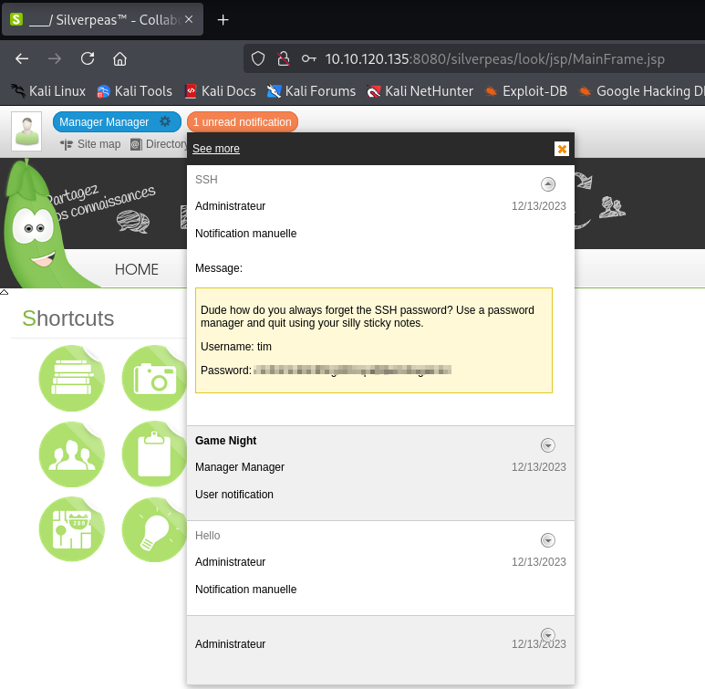

## SSH Access
```bash
ssh tim@10.10.120.135
```

### Basic Enumeration
```bash
id && whoami
uname -a
cat /etc/os-release
cat /proc/version
hostnamectl
sudo -l
```

### Results:
- User: `tim`
- OS: Ubuntu 22.04.3 LTS
- Kernel: 5.15.0-91-generic
- Virtualisation: Amazon EC2
- No `sudo` privileges, but part of the `adm` group.

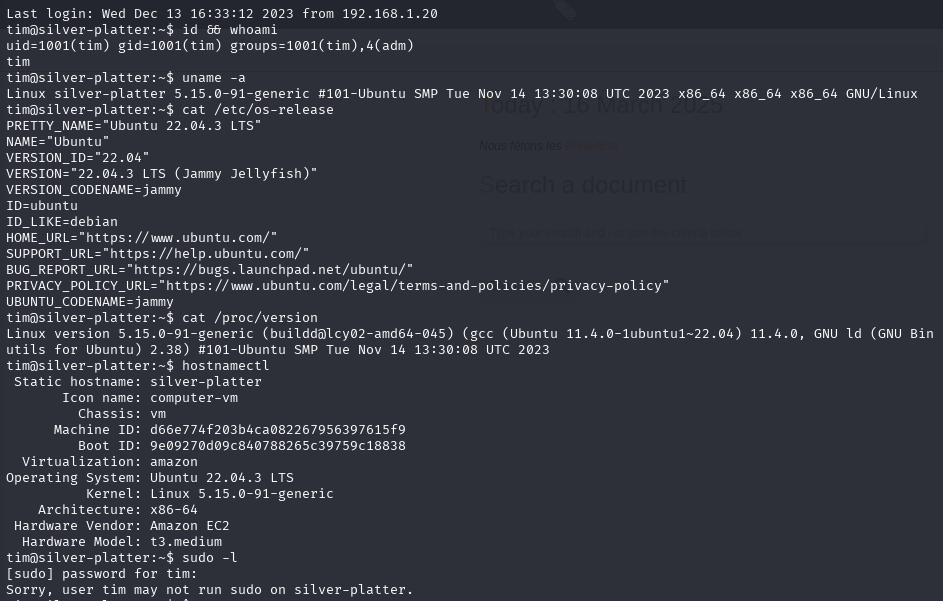

---
### `/etc/passwd` Check
```bash
cat /etc/passwd
```

Identified user accounts:
- `root`
- `tyler`
- `tim`

`cat /etc/shadow` - Permission denied

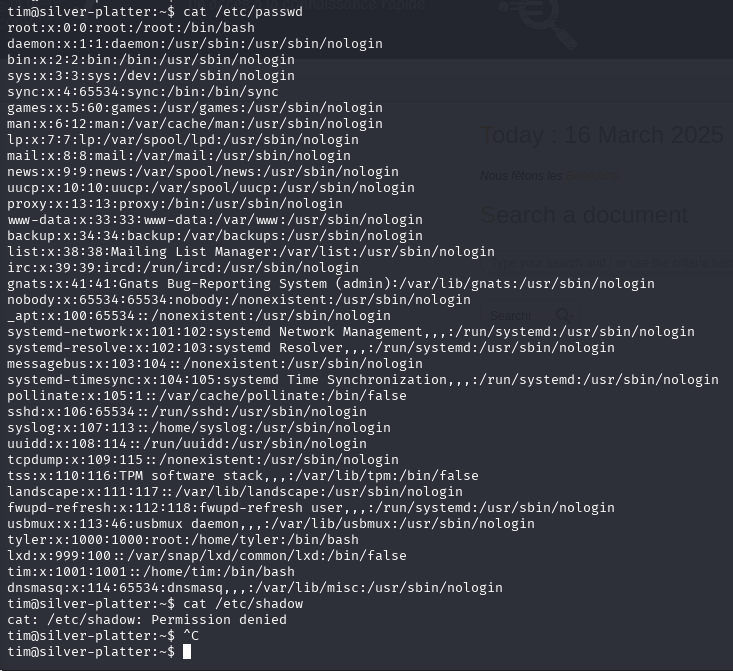
### Listing Files and Obtaining User Flag

```bash
ls -la
cat user.txt
```

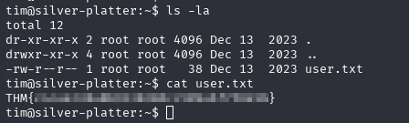

- **User flag obtained**

### Attempt to Access Tyler's Directory

```bash
cd /home
cd tyler - permission denied
```

## Privilege Escalation

### Search for adm Group

```bash
find / -group adm -ls 2>/dev/null
```
**Explanation:**
- **`find /`**: This initiates a search starting from the root directory (`/`) and traverses through all subdirectories.
-  **`-group adm`**: This flag filters the search to only show files that belong to the group `adm`.
-  **`-ls`**: This option displays the results in a long listing format, providing information such as file permissions.
-  **`2>/dev/null`**: This redirects any error messages to `/dev/null`, which discards them.

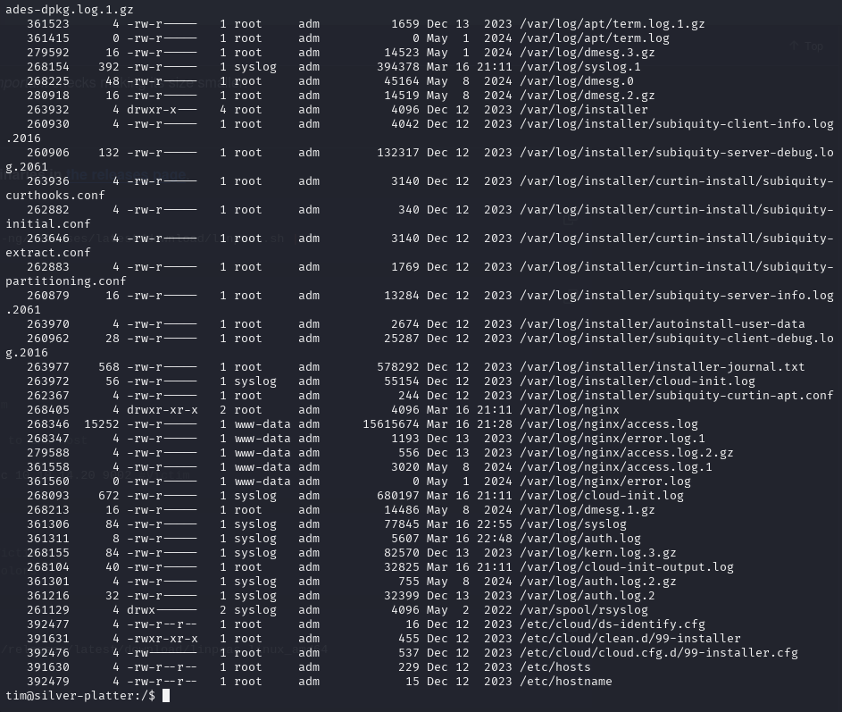
### Accessing Auth Logs

```bash
tim@silver-platter:/var/log$ ls -la
```

- We have read access to multiple logs.

### Searching for Password in Logs

```bash
grep -ir "password"
```
- **`-i`**: Stands for **"ignore case"**. This makes the search case-insensitive, so it will match "Password", "PASSWORD", or any variation in case.
- **`-r`**: Stands for **"recursive"**. This tells `grep` to search through all files and directories recursively.

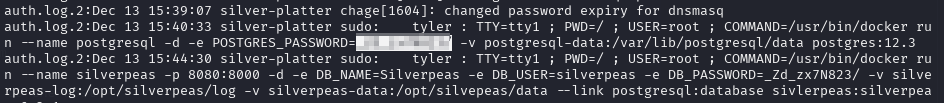

- Found credentials:

```bash
auth.log.2:Dec 13 15:40:33 silver-platter sudo:    tyler : TTY=tty1 ; PWD=/ ; USER=root ; COMMAND=/usr/bin/docker run --name postgresql -d -e POSTGRES_PASSWORD=[REDACTED] -v postgresql-data:/var/lib/postgresql/data postgres:12.3
```

## Switching to Tyler

```bash
su tyler
```

## Confirming User and Sudo Privileges

```bash
whoami && id && sudo -l
```

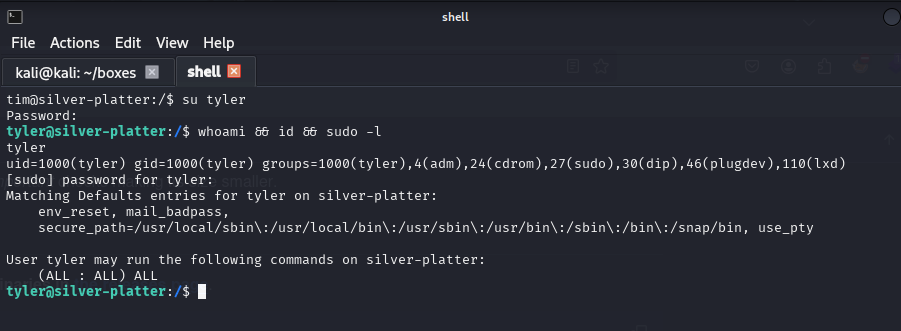

- User: tyler
- Groups: adm, sudo, lxd, etc.
- Sudo Privileges: `(ALL : ALL) ALL`
## Root Access

```bash
sudo /bin/bash
```

## Obtaining Root Flag

```bash
cd /root
cat root.txt
```

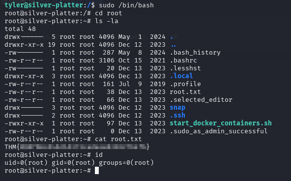

- **Root flag obtained**

## Verification of Root Permissions

```bash
id
```

- Confirmed **root** access.
## Tools Used

- Nmap - A network scanning tool used to discover open ports and services.
- Gobuster - A directory brute-forcing tool to find hidden files and directories.
- Burp Suite - A web proxy tool used to intercept and manipulate HTTP requests.
- SSH - Secure Shell used to access the target machine remotely.
- Linux File Enumeration Commands - Used to identify privilege escalation paths.
- Grep - Used to search through log files for sensitive information.

---

## Conclusion

- Successfully gained **Root Access**
- Captured both **user** and **root flags**
- Privilege Escalation through **credentials found in auth logs**

---

## Final Thoughts

- Authentication Bypass - The Silverpeas platform was vulnerable to an authentication bypass exploit (CVE-2024-36042), allowing access without valid credentials.
- Improper secrecy of passwords and transmission via insecure means were observed.
- Weak Password Management - Credentials for the `tim` user were exposed in the `/var/log/auth.log.2` file, leading to privilege escalation.
- Misconfigured User Privileges - The `tyler` user had full `sudo` access, allowing immediate escalation to root once the credentials were obtained.
